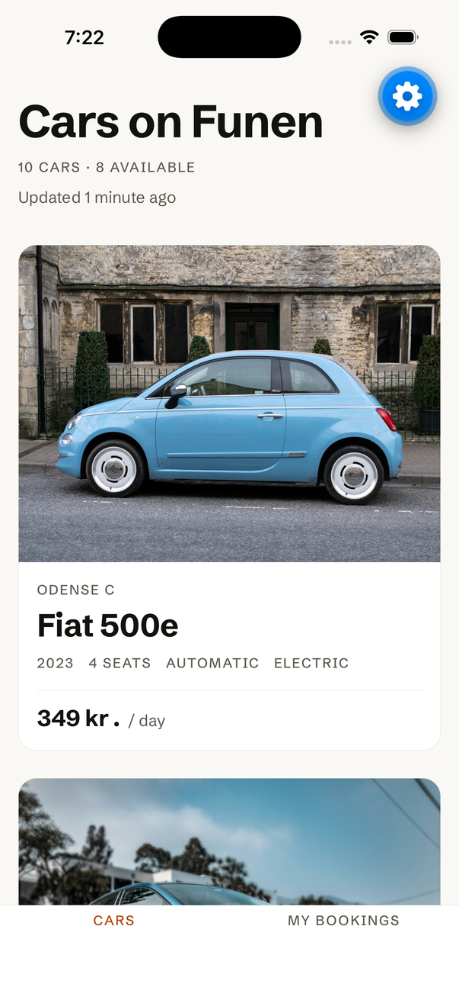
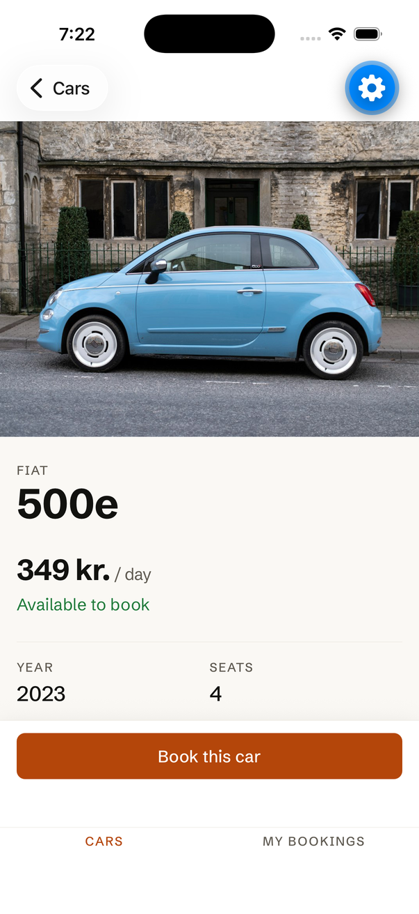
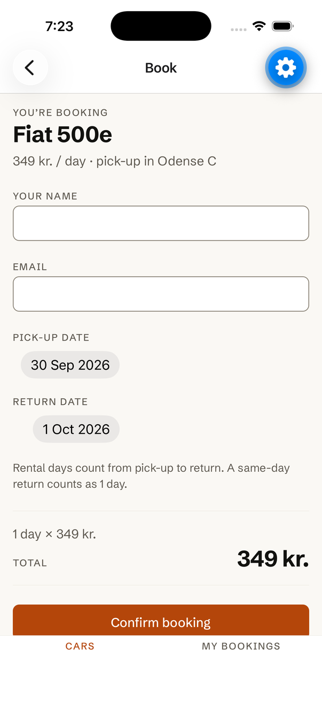
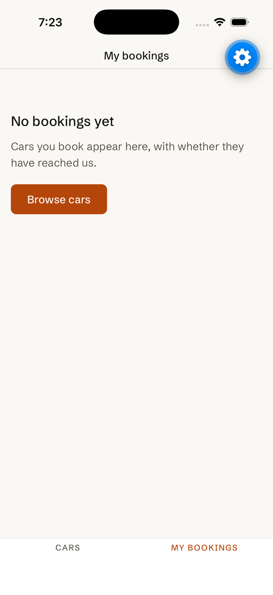

# Car Rental App

A car rental app for Funen, Denmark, built in React Native with Expo. You can browse the cars,
open a car to see its details, and book it. It keeps working without a network: cars you've
already seen stay readable, a booking made offline is saved on the phone and sent later, and you
can always see whether a booking has reached the server.

Coursework for **Mobile Software Design & Development**, University of Southern Denmark (SDU),
autumn 2026. Project A, a group of six. The process is graded alongside the code, which is why
this repository also contains its own rulebook ([AGENTS.md](AGENTS.md)), a log of every
significant use of AI ([docs/ai-log/](docs/ai-log/README.md)) and CI.

## What it looks like

|                   The car list                    |                   A car's details                   |                        Booking                        |                           My bookings                            |
| :-----------------------------------------------: | :-------------------------------------------------: | :---------------------------------------------------: | :--------------------------------------------------------------: |
|  |  |  |  |

These are real screenshots of the app running in Expo Go on the iPhone 17 simulator, against the
live API, taken on 2026-09-30. The blue gear button is Expo Go's developer menu, not part of the
app. There are no screenshots of the offline states or of a booking being retried: those need a
real device (airplane mode, a degraded network) and are covered by the
[demo video script](docs/demo-video-script.md) instead. There is no GIF for the same reason.

## What it does

| Requirement                                        | In the app                                                                                                 |
| -------------------------------------------------- | ---------------------------------------------------------------------------------------------------------- |
| View a list of cars                                | The **Cars** tab                                                                                           |
| View a car's details                               | Tap a car                                                                                                  |
| Place a booking                                    | **Book this car**, a form with validation and a live total                                                 |
| Use an API                                         | Cars are fetched from, and bookings sent to, a hosted JSON API                                             |
| Persist API data                                   | The car list and your bookings are saved on the phone                                                      |
| **K1** — data already fetched is available offline | The saved cars are shown at once and refreshed in the background; a banner says when you're offline        |
| **K2** — a failed write is queued and retried      | A booking that can't be sent is retried after 2 s, 8 s and 30 s, then offers **Try again**                 |
| **K3** — sync status is always visible             | Every booking shows _Saving…_, _Couldn't save yet_ or _Confirmed_; a message appears when a retry succeeds |

Which file implements each of these, and which test proves it, is in
[docs/requirements-coverage.md](docs/requirements-coverage.md).

## Run it

You need **Node 22.13 or newer** and the **Expo Go** app on your phone (or an iOS simulator /
Android emulator).

```bash
git clone https://github.com/aabodeh/CarRentalApp.git
cd CarRentalApp
npm ci
npx expo start
```

Then:

- **On a phone:** scan the QR code with the camera (iOS) or with Expo Go (Android). The phone
  and the computer must be on the same network.
- **On a simulator:** press `i` for iOS or `a` for Android.

The app needs nothing else: no account, no API key, no `.env` file.

Running in a web browser is not set up.

## The API

The app talks to a [MockAPI](https://mockapi.io) project: a free hosted JSON API. We did not
build or host a backend.

- **No authentication.** Anyone with the URL can read and write, so the URL is not a secret and is
  committed in [`app.json`](app.json) under `expo.extra.apiBaseUrl`.
- **`/cars`** holds the ten cars; the app only reads it. **`/bookings`** receives the bookings
  you make.
- **If the API is down or the URL is wrong,** the app does not crash. It shows the cars it has
  saved, marked as a saved copy, or, on a first launch with nothing saved, an error with a
  **Try again** button.
- The resources, the seed data and what we observed about how MockAPI behaves are in
  [docs/api/README.md](docs/api/README.md).

## Check it

```bash
npm run check
```

This runs the linter, the formatting check, the type-checker and the tests, in that order. It is
exactly what CI runs on every pull request. At the time of writing (2026-09-30) that is 359
tests in 46 files; run it to see the current number.

| Command                | What it does                                                   |
| ---------------------- | -------------------------------------------------------------- |
| `npm start`            | The Expo dev server (same as `npx expo start`)                 |
| `npm run check`        | Lint, format check, typecheck and tests, in order              |
| `npm run lint`         | ESLint, including the architecture rules; fails on any warning |
| `npm run format`       | Prettier, writing changes                                      |
| `npm run format:check` | Prettier, checking only                                        |
| `npm run typecheck`    | `tsc --noEmit`                                                 |
| `npm test`             | Jest in watch mode                                             |
| `npm run test:ci`      | Jest once, with coverage                                       |

## How it is built

```
screens / components      render and handle presses
        │
hooks / context           loading, error and sync state
        │
repositories              the only layer that knows where data comes from
        ├── services/api/   the HTTP client
        └── storage/        what is saved on the phone
```

Screens never call `fetch` and never touch storage; ESLint fails the build if they try. That
boundary let us replace the app's built-in sample data with the real API by changing ten lines
in the screens. The measurement is in
[docs/development-report-notes.md](docs/development-report-notes.md).

```
App.tsx                 providers + navigation
__tests__/              all tests, mirroring src/
src/
  screens/              one file per screen
  components/           reusable pieces of UI
  navigation/           the two tabs, and the Cars stack
  context/              BookingContext: bookings and the retry queue
  hooks/                useCars, useCar, useMyBookings, useNetworkStatus, …
  repositories/         carRepository, bookingRepository, the retry queue and its rules
  services/api/         fetch with a timeout, typed errors, validated replies
  storage/              the offline cache and the saved bookings
  types/                Car, Booking, and the runtime checks for them
  theme/                colours, spacing, type and motion tokens
  utils/                small pure functions (dates, prices, validation)
  data/dummy/           the ten sample cars: the API's seed and the tests' fixture
docs/                   everything below
```

Every folder under `src/` has a README saying what belongs in it.

## Where to read more

| Document                                                             | What it is                                                                                                                               |
| -------------------------------------------------------------------- | ---------------------------------------------------------------------------------------------------------------------------------------- |
| [AGENTS.md](AGENTS.md)                                               | The rulebook: architecture, conventions, testing rules, the Definition of Done, and lessons learned. For people and AI assistants alike. |
| [CONTRIBUTING.md](CONTRIBUTING.md)                                   | Branches, commits, pull requests, and how to log AI use.                                                                                 |
| [docs/requirements-coverage.md](docs/requirements-coverage.md)       | Each requirement → the files that implement it → the tests that prove it → what was deferred. Checked by a test.                         |
| [docs/development-report-notes.md](docs/development-report-notes.md) | Facts and numbers behind the development report: conventions, architecture, patterns, testing, process.                                  |
| [docs/demo-video-script.md](docs/demo-video-script.md)               | A shot-by-shot script for the demo video.                                                                                                |
| [docs/api/README.md](docs/api/README.md)                             | The API: resources, seed data, observed behaviour.                                                                                       |
| [docs/ai-log/](docs/ai-log/README.md)                                | The AI dossier: every significant AI interaction (`A-###`) and every AI failure (`FL-###`).                                              |
| [CLAUDE.md](CLAUDE.md)                                               | AGENTS.md plus the Claude Code commands `/log-ai` and `/log-failure`.                                                                    |

`docs/` is also an [Obsidian](https://obsidian.md) vault: open the `docs` folder as a vault to
browse the AI log with working links.

## What is not in it

Deliberately left out, to do the required parts properly:

- retrying a booking while the app is closed
- editing or cancelling a booking
- syncing bookings between devices
- accounts and sign-in
- searching or filtering the cars
- dark mode (the colours are defined and tested, but the app ships light)
- push notifications

## Licence

See [LICENSE](LICENSE).
